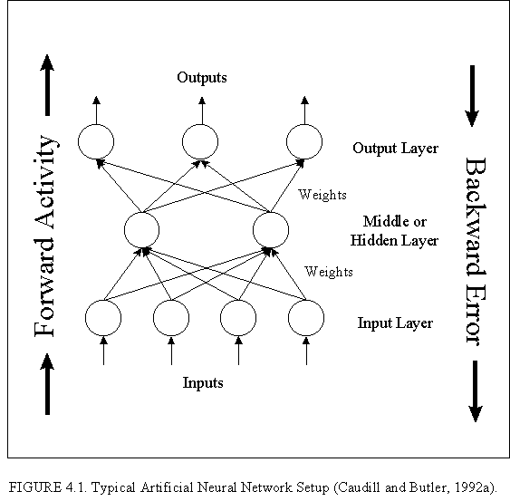



## Neural Networks: Understanding Using Visual Basic \- Download tutorial

### Description

A neural network tutorial for Visual Basic programmers. The previous post got all messes up, so here is the tutorial. Read nn_tutorial.html included in the zip file.
 
### More Info
 

             |
---                |---
**Submitted On**   |2004-07-18 10:59:44
**By**             |[Paras Chopra](https://github.com/Planet-Source-Code/PSCIndex/blob/master/ByAuthor/paras-chopra.md)
**Level**          |Intermediate
**User Rating**    |4.9 (34 globes from 7 users)
**Compatibility**  |VB 3\.0, VB 4\.0 \(16\-bit\), VB 4\.0 \(32\-bit\), VB 5\.0, VB 6\.0
**Category**       |[Miscellaneous](https://github.com/Planet-Source-Code/PSCIndex/blob/master/ByCategory/miscellaneous__1-1.md)
**World**          |[Visual Basic](https://github.com/Planet-Source-Code/PSCIndex/blob/master/ByWorld/visual-basic.md)
**Archive File**   |[Neural\_Net1771147182004\.zip](https://github.com/Planet-Source-Code/paras-chopra-neural-networks-understanding-using-visual-basic-download-tutorial__1-55011/archive/master.zip)

